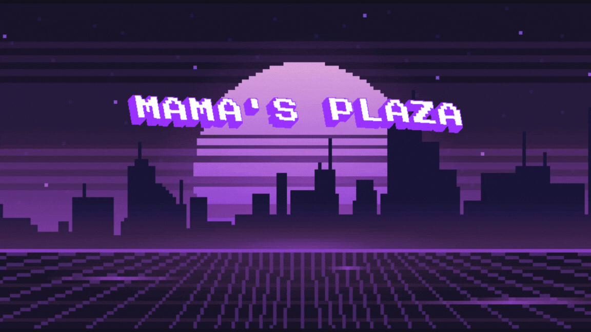

# Mama's Plaza: Jogos Retrô

    

Este projeto consiste no desenvolvimento de um fliperama denominado Mama's Plaza: Jogos retrô, implementado na linguagem Processing. O fliperama reúne quatro jogos clássicos: Astroid, Pikomon, Frogger e Ping Pong, proporcionando uma experiência nostálgica ao usuário. Cada jogo foi cuidadosamente selecionado e adaptado para manter a diversão ao usuário, ao mesmo tempo em que se proporciona uma interface retro proposta pelo fliperama. O projeto visa explorar tanto a recriação de experiências da era dos jogos eletrônicos clássicos quanto a aplicação de conceitos de programação voltados para o design de jogos interativos.

## Jogos

### Frogger
Uma recriação do clássico arcade, onde o jogador controla um sapo que deve atravessar uma rua movimentada e um rio perigoso, evitando obstáculos para chegar ao seu destino em segurança.

### Astroid
Baseado no icônico jogo Asteroid, onde o jogador pilota uma nave espacial em um campo de asteroides, devendo destruir os corpos celestes enquanto evita colisões.

### Pikomon
Uma versão criativa inspirada na franquia Pokémon, desenvolvendo uma Pokédex interativa que permite ao jogador explorar uma coleção de Pokémons.

### Pong
Recria o clássico jogo de ping-pong, considerado um dos primeiros jogos eletrônicos, onde dois jogadores competem em uma partida de tênis de mesa virtual.

## Desenvolvimento

O desenvolvimento do fliperama Mama's Plaza: Jogo retrô incorporou diversos conceitos aprendidos em sala de aula, fundamentais para a organização e implementação do projeto. A estruturação do código foi realizada utilizando o conceito de classes, permitindo a criação de objetos distintos para cada componente dos jogos, como personagens, inimigos, e elementos interativos. Essa abordagem facilitou a modularização do código, permitindo que diferentes partes do projeto fossem desenvolvidas e testadas de forma independente.

Além disso, o código foi organizado em múltiplos arquivos, cada um responsável por diferentes aspectos do projeto, como a lógica dos jogos, a manipulação de animações, e o gerenciamento de sons. Isso não apenas melhorou a clareza e a manutenção do código, mas também possibilitou a reutilização de trechos de código em diferentes partes do fliperama.

## Desafios Técnicos

### Tela Inicial
A implementação de GIFs, a captura de teclas e o texto piscante exigiram uma programação cuidadosa para garantir uma interface fluida e cativante.

### Menu de Seleção de Jogos
Navegar entre as opções com as teclas direcionais e confirmar com 'Z' foi um exercício de interação com o usuário e as diferentes cenas disponíveis.

### Jogos
- **Astroid**: Criação de asteroides, controle das colisões e simulação de explosões.
- **Pikomon**: Integração de um banco de dados local (pokemons.json) para extrair informações dos Pokémons.
- **Frogger**: Manipulação de sprites, troca de animações, geração de obstáculos em diferentes direções, e verificação de colisões.
- **Pong**: Garantir que a bola invertesse a direção corretamente ao atingir as bordas e contabilizar os pontos adequadamente.

## Dependências

- `sound`: Biblioteca para manipulação de sons.
- `gifAnimation`: Biblioteca para manipulação de GIFs.

## Instalação

Para executar este projeto, é necessário ter o Processing instalado. Processing é uma linguagem de programação e ambiente de desenvolvimento integrado (IDE) voltado para a criação de arte visual e projetos interativos. Você pode baixar e instalar o Processing a partir do site oficial: [Processing](https://processing.org/download/).

## Desenvolvedores

- [@wfabi0](https://github.com/wfabi0) - Fábio Milagres
- [@JoaoPedroDupim](https://github.com/JoaoPedroDupim) - João Pedro Dupim

## Referências

- ATARI, INC. [Atari](https://www.atari.com). Acesso em: 1 set. 2024.
- EK_VITKI. [Pixel Cosmos: Artistic HD Space Wallpaper](https://wall.alphacoders.com/big.php?i=1311265). Acesso em: 4 set. 2024.
- FONSECA, A. C. [Frogger-Game](https://github.com/AfonsoCFonseca/Frogger-Game/tree/master/assets). Acesso em: 1 set. 2024.
- FROGGER FANDOM. [Frogger (video game)](https://frogger.fandom.com/wiki/Frogger_(video_game)). Acesso em: 4 set. 2024.
- ICEBOY. [8bit](https://br.pinterest.com/pin/816277501204975081/). Acesso em: 4 set. 2024.
- KITS. [Papéis de Parede Vintage](https://br.pinterest.com/pin/pokemon-wallpaper-pixel--131800726590617643/). Acesso em: 4 set. 2024.
- KONAMI. [Konami Digital Entertainment](https://www.konami.com). Acesso em: 28 ago. 2024.
- NINTENDO. [Nintendo](https://www.nintendo.com). Acesso em: 24 ago. 2024.
- OPEN GAME ART. [Preview_1](https://opengameart.org/sites/default/files/Preview_1.gif). Acesso em: 24 ago. 2024.
- PROCESSING. [Reference](https://processing.org/reference). Acesso em: 4 set. 2024.
- POKEAPI. [PokeAPI](https://pokeapi.co). Acesso em: 29 ago. 2024.